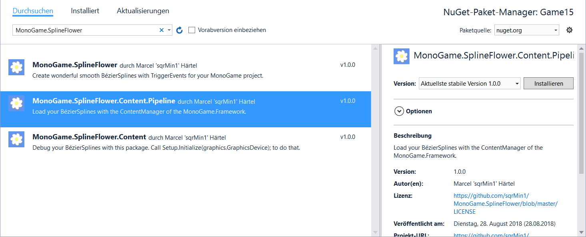
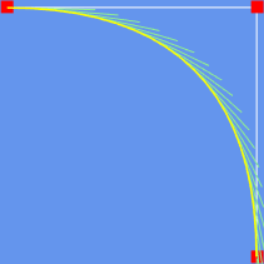
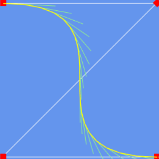
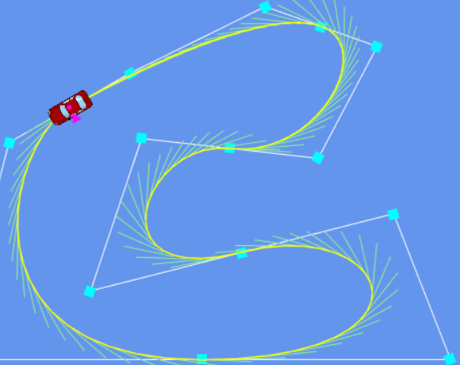
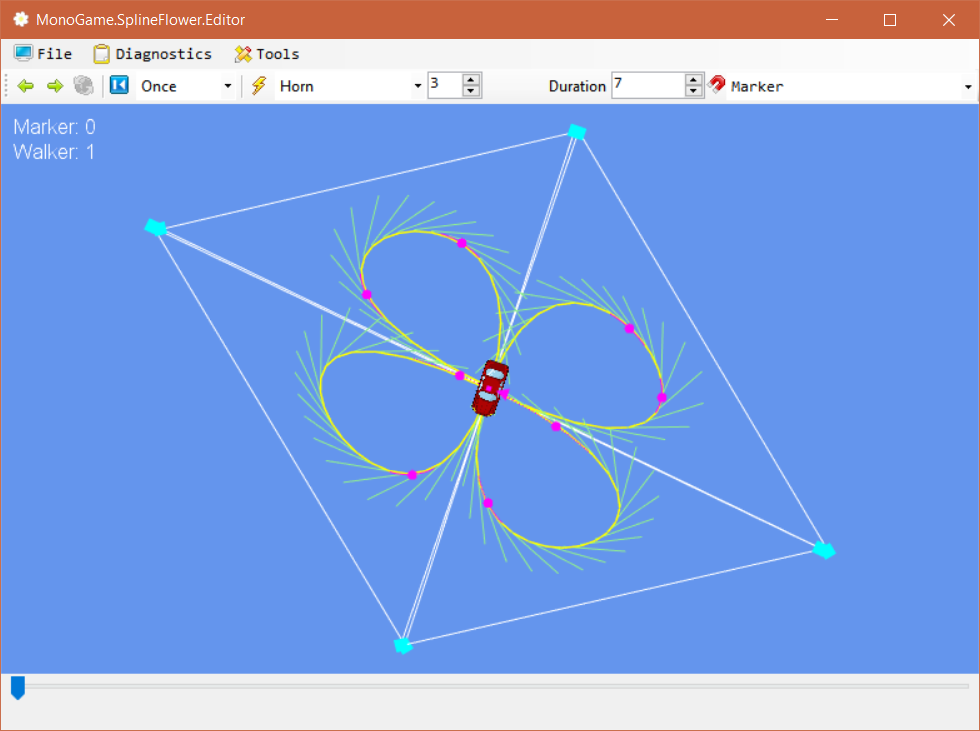
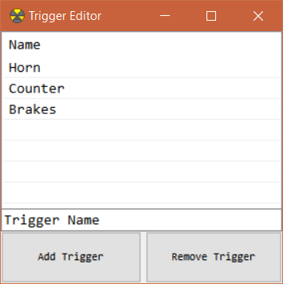

# Welcome to MonoGame.SplineFlower!
[](https://twitter.com/sqrMin1)
[](https://github.com/sqrMin1/MonoGame.SplineFlower/blob/master/LICENSE)

[](https://www.nuget.org/packages/MonoGame.SplineFlower)
[](https://www.nuget.org/packages/MonoGame.SplineFlower.Content)
[](https://www.nuget.org/packages/MonoGame.SplineFlower.Content.Pipeline)

Create wonderful smooth **BézierSplines** with **TriggerEvents** for your **MonoGame** project.

### Building

* The **MonoGame.SplineFlower** project is compatible with the **MonoGame.Framework 3.6** and above.

# How-To
### Setup

The **Visual Studio 2015** solution contains the following projects:
- **MonoGame.SplineFlower** (the portable class library)
- **MonoGame.SplineFlower.Content** (spline data and setup class)
- **MonoGame.SplineFlower.Content.Pipeline** (creates .xnb files out of .json BézierSpline data)
- **MonoGame.SplineFlower.Samples** (showing features of the library)
- **MonoGame.SplineFlower.Editor** (create, import and export BézierSplines)
- **MonoGame.SplineFlower.GameTest** (DesktopGL project which loads a BézierSpline with the ContentManager)

1. In your own MonoGame project you need to reference **MonoGame.SplineFlower** if you want to use the library capabilities
2. If you want to load BézierSplines with the **ContentManager**, you also need to reference **MonoGame.SplineFlower.Content.Pipeline**
> Note: You don't need this reference if you want to load BézierSpline data with **Json.Net**
3. When you want to draw the BézierSpline - inclusive trigger events - you need to reference **MonoGame.SplineFlower.Content** to have access
to the **static class Setup**, because you need to call **Setup.Initialize(graphics.GraphicsDevice);** for this purpose
> Note: You don't need this reference if you don't want to draw your BézierSplines. **You don't need to draw BézierSpline at all.**
This is just a **Debug** feature to make your life as a game developer easier ;)

For an easy installation you should make use of the nuget package manager:


### Capabilities

So what can this library actually do for you?

Despite drawing simple lines, it can also generate:

#### Quadratic BézierCurves


#### Cubic BézierCurves


#### Complex BézierSplines


Creating BézierSplines is very easy with the: 

#### MonoGame.SplineFlower.Editor


It is also possible to create **looped** or **multiple looped** BézierSplines as you can see!

Did you noticed the nice little car on the picture? This is a **[SplineWalker](https://github.com/sqrMin1/MonoGame.SplineFlower/blob/master/MonoGame.SplineFlower/SplineWalker.cs)**.

A SplineWalker can, well... walk on splines :) or drive on it like in the case of a car, hehe.

You have the abillity to create your own SplineWalkers by inheritting from the SplineWalker class mentioned above.

This could look like this:

```c#
public class Car : SplineWalker
{
    public override void CreateSplineWalker(BezierSpline spline, SplineWalkerMode mode, int duration, bool canTriggerEvents = true, bool    autoStart = true)
    {
        base.CreateSplineWalker(spline, mode, duration, canTriggerEvents, autoStart);
    }
    
    protected override void EventTriggered(Trigger obj)
    {
        base.EventTriggered(obj);
    }
    
    public override void Update(GameTime gameTime)
    {
        base.Update(gameTime);
    }
    
    public override void Draw(SpriteBatch spriteBatch)
    {
        base.Draw(spriteBatch);
    }
}
```

Click **[here](https://github.com/sqrMin1/MonoGame.SplineFlower/blob/master/MonoGame.SplineFlower.Samples/Car.cs)** to see a full integration example.

A nice thing about a SplineWalker is, that he can trigger custom events on a BézierSpline while he walks along the spline.

You can define your own Trigger with the TriggerEditor:



It is reachable from the main editor through the **Tools** button.

---

You can do pretty much anything with BézierSplines. The limit is really just your imagination.
*Play around with the samples and learn from it.*

### Now Have Fun with MonoGame.SplineFlower!
[](https://twitter.com/sqrMin1)
[](https://github.com/sqrMin1/MonoGame.SplineFlower/blob/master/LICENSE)

[](https://www.nuget.org/packages/MonoGame.SplineFlower)
[](https://www.nuget.org/packages/MonoGame.SplineFlower.Content)
[](https://www.nuget.org/packages/MonoGame.SplineFlower.Content.Pipeline)


