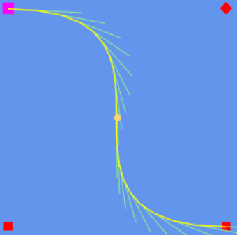

# Welcome to MonoGame.SplineFlower!
[](https://twitter.com/blizz_crafter)
[](https://github.com/sqrMin1/MonoGame.SplineFlower/blob/master/LICENSE)

[](https://www.nuget.org/packages/MonoGame.SplineFlower)
[](https://www.nuget.org/packages/MonoGame.SplineFlower.Content)
[](https://www.nuget.org/packages/MonoGame.SplineFlower.Content.Pipeline)

Create wonderful smooth **Bézier-, CatMulRom- and Hermite-Splines** with **TriggerEvents** for your **MonoGame** project.

### Building

* The **MonoGame.SplineFlower** project is compatible with the **MonoGame.Framework 3.6** and above.

# How-To
### Setup

The **Visual Studio 2019** solution contains the following projects:
- **MonoGame.SplineFlower** (the portable class library)
- **MonoGame.SplineFlower.Content** (spline data and setup class)
- **MonoGame.SplineFlower.Content.Pipeline** (creates .xnb files out of .json spline data)
- **MonoGame.SplineFlower.Samples** (showing features of the library)
- **MonoGame.SplineFlower.Editor** (create, import and export splines)
- **MonoGame.SplineFlower.GameTest** (DesktopGL project which loads a spline with the ContentManager)

1. In your own MonoGame project you need to reference **MonoGame.SplineFlower** if you want to use the library capabilities
2. If you want to load splines with the **ContentManager**, you also need to reference **MonoGame.SplineFlower.Content.Pipeline**
> Note: You don't need this reference if you want to load spline data with **Json.Net**
3. When you want to draw the spline - inclusive trigger events - you need to reference **MonoGame.SplineFlower.Content** to have access
to the **static class Setup**, because you need to call **Setup.Initialize(graphics.GraphicsDevice);** for this purpose
> Note: You don't need this reference if you don't want to draw your splines. **You don't need to draw splines at all.**
This is just a **Debug** feature to make your life as a game developer easier ;)

For an easy installation you should make use of the nuget package manager:


### Capabilities

So what can this library actually do for you? **[[Watch the Video!](https://youtu.be/0Wez5AryxwI)]** (Outdated!)

Despite drawing simple lines, it generates very smooth BézierCurves, BézierSplines, CatMulRomSplines and HermiteSplines pretty fast,
because it uses **polynomial math formulas** behind the scenes.

This makes it possible to generate:

#### Quadratic BézierCurves


#### Cubic BézierCurves


#### Complex BézierSplines


#### Complex CatMulRomSplines


#### Chain Splines


#### Complex HermiteSplines


#### Polygon Stripe Splines


Did you notice the different colors of the control points?
You can set them in 3 different modes:


- **Free** allows you to freely place the control point, but often resulting in sharp corners.
- **Aligned** will enforce such corners and allow you to have connected control points asymmetrical.
- **Mirrored** behave like the aligned one, but allow you to have the connected control points symmetrical.

> Note: A CatmulRomSpline will always have its control points in the **Free** mode!

You can change control modes simply by clicking on them with the **Right Mouse Button** in the:

#### MonoGame.SplineFlower.Editor


It is also possible to create **looped** splines as you can see!
With the **Middle Mouse Button** you can drag the whole spline to keep the overview.

Did you noticed the nice little car on the picture? This is a **[SplineWalker](https://github.com/sqrMin1/MonoGame.SplineFlower/blob/master/MonoGame.SplineFlower/SplineWalker.cs)**.

A SplineWalker can, well... walk on splines :) or drive on it like in the case of a car, hehe.

You have the abillity to create your own SplineWalkers by inheritting from the SplineWalker class mentioned above.

This could look like this:

```c#
public class Car : SplineWalker
{
    public override void CreateSplineWalker(BezierSpline spline, SplineWalkerMode mode, int duration, bool canTriggerEvents = true, bool    autoStart = true)
    {
        base.CreateSplineWalker(spline, mode, duration, canTriggerEvents, autoStart);
    }
    
    protected override void EventTriggered(Trigger obj)
    {
        base.EventTriggered(obj);
    }
    
    public override void Update(GameTime gameTime)
    {
        base.Update(gameTime);
    }
    
    public override void Draw(SpriteBatch spriteBatch)
    {
        base.Draw(spriteBatch);
    }
}
```

Click **[here](https://github.com/sqrMin1/MonoGame.SplineFlower/blob/master/MonoGame.SplineFlower.Samples/Car.cs)** to see a full integration example.

A nice thing about a SplineWalker is, that he can trigger custom events on a spline while he walks along the spline.

You can define your own Trigger with the TriggerEditor:


It is reachable from the main editor through the **Tools** button.

A SplineWalker also has 3 different built-in movement modes:

- **Once** travels the spline just one time and will stop at the last control point.
- **Looped** travels the spline infinitely (smoothly starts again at the starting point).
- **PingPong** travels the spline forward and then backward when he reaches the last control point / starting point (infinitely).

It's also possible to define different trigger directions:

- **Forward** triggers only in the forward direction.
- **Backward** triggers only in the backward direction.
- **ForwardAndBackward** triggers in both directions.

> Note: It's also possible to control a SplineWalker with your Keyboard or GamePad if you wish so!

---

You can do pretty much anything with splines. The limit is really just your imagination.
*Play around with the samples and learn from it.*


### Now Have Fun with MonoGame.SplineFlower!
[](https://twitter.com/blizz_crafter)


